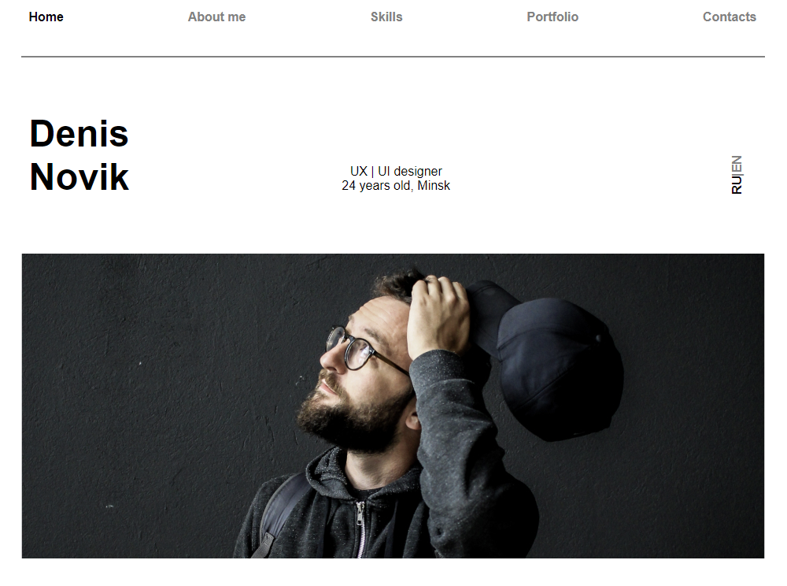

# UI/UX Designer Portfolio Page #

Сайт-визитка UI/UX дизайнера. Сделано в рамках курса IT Academy.

Сайт написан на HTML/JS/CSS, без использования препроцессоров и сборки проекта.

[Github Pages](https://m12d15.github.io/page-designer/)

[Исходный макет на Figma](https://www.figma.com/file/5D9pDuLtS042hzaoN69Kd7/Free--Landing--Page-Template?node-id=254%3A515&t=OcdC0kkJTSqg88wN-0)